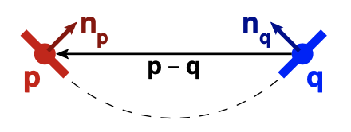
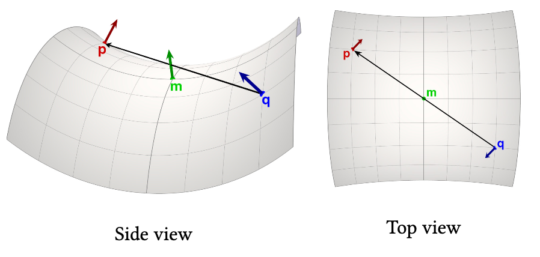
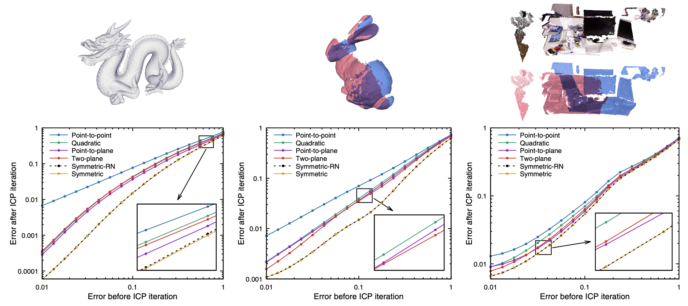

The Iterative Closest Point (ICP) algorithm, commonly used for alignment of 3D models, has previously been defined using either a point-to-point or point-to-plane objective. Alternatively, researchers have proposed computationally-expensive methods that directly minimize the distance function between surfaces. We introduce a new symmetrized objective function that achieves the simplicity and computational efficiency of point-to-plane optimization, while yielding improved convergence speed and a wider convergence basin. In addition, we present a linearization of the objective that is exact in the case of exact correspondences. We experimentally demonstrate the improved speed and convergence basin of the symmetric objective, on both smooth models and challenging cases involving noise and partial overlap.

# INTRODUCTION

Registration of 3D shapes is a key step in both 3D model creation (from scanners or computer vision systems) and shape analysis. For rigid-body alignment based purely on geometry (as opposed to RGB-D), the most common methods are based on variants of the Iterative Closest Point (ICP) algorithm [[Besl and McKay 1992]](#ref1). In this method, points are repeatedly selected from one model, their nearest points on the other model (given the current best-estimate rigidbody alignment) are selected as correspondences, and an incremental transformation is found that minimizes distances between point pairs. The algorithm eventually converges to a local minimum of surface-to-surface distance. 

Because ICP-like algorithms can be made efficient and reliable, they have become widely adopted. As a result, researchers have focused on both addressing the shortcomings of ICP and extending it to new settings such as color-based registration and non-rigid alignment. One particular class of improvements has focused on the loss function that is optimized to obtain an incremental transformation. For example, as compared to the original work of Besl and McKay, which minimized point-to-point distance, the method of [Chen and Medioni [1992]](#ref4) minimized the distance between a point on one mesh and a plane containing the matching point and perpendicular to its normal. This point-to-plane objective generally results in faster convergence to the correct alignment and greater ultimate accuracy, though it does not necessarily increase the basin of convergence. Work by [Fitzgibbon [2001]](#ref10), [Mitra et al. [2004]](#ref19), and [Pottmann et al. [2006]](#ref22) showed that both point-to-point and point-to-plane minimization may be thought of as approximations to minimizing the squared Euclidean distance function of the surface, and they presented algorithms that achieved greater convergence speed and stability, albeit at the cost of greater computational complexity and/or auxiliary data structures.

This paper proposes a symmetrized version of the point-to-plane objective for use in ICP, incorporating two key ideas. First, the plane in which the error is minimized is based on the surface normals of both points in the corresponding pair. Second, the optimization is performed in a "stationary" coordinate system, while both meshes are moved in opposite directions. These changes require a relatively small modification to the optimization problem being performed, and almost no increased computation per iteration, but result in improved convergence of ICP.

The reason for this improvement is that the symmetric objective is minimized whenever the pair of points lies on a second-order (constant-curvature) patch of surface, rather than being minimized only if the points are on a plane. Thus, we gain some of the same benefits as second-order distance function minimization methods, but without explicit computation of second-order surface properties, or the need for volumetric data structures to store an approximation to the squared Euclidean distance function.

In addition to the primary contribution of the new symmetric objective, we also introduce an alternative approach to linearization of rotations that allows us to reduce the optimization to a linear least-squares problem, while still solving for the exact transformation when correspondences are exact. We conduct experiments that demonstrate both greater per-iteration error reduction and an increase in the convergence basin for our proposed method.

# RELATED WORK
Since the original ICP algorithms by [Besl and McKay [1992]](#ref1) and [Chen and Medioni [1992]](#ref4), there have been significant efforts to improve convergence and stability. For a comprehensive overview of many variants, see the surveys by [Rusinkiewicz and Levoy [2001]](#ref24), [Díez et al. [2015]](#ref7), and [Pomerleau et al. [2015]](#ref21). Much of this work focuses on finding better correspondences (e.g., by matching local surface properties or descriptors), performing outlier-tolerant optimization, or generalizing to non-rigid deformation. Here we focus specifically on methods that modify the objective function and/or the strategy for minimizing it.

[Segal et al. [2009]](#ref25) generalize ICP to associate a probabilistic model (in practice, a covariance matrix) with each point. This allows for a "soft plane-to-plane" minimization that improves the matching of planar surfaces. [Halber and Funkhouser [2017]](#ref13) have explored incorporating additional constraints between planes, such as parallelism or orthogonality, into registration.

[Fitzgibbon [2001]](#ref10) proposes to directly minimize the distance between samples on one shape (referred to as "data") and the second shape itself (the "model"). This is done by computing the squared distance transform of the model, evaluating it at data locations, applying a robustifying kernel, and minimizing the result using Levenberg-Marquardt. [Mitra et al. [2004]](#ref19) propose two methods for using the distance field of a shape for optimization: one based on local quadratic approximation at closest corresponding points, and the other based on a global hierarchical $d^2$-Tree data structure [[Leopoldseder et al. 2003]](#ref16) that stores a bounded-error approximation to the global squared distance field. [Pottmann et al. [2006]](#ref22) analyze the theoretical properties of distance-function minimization, and demonstrate its improved convergence.

The variants described above all perform local minimization, requiring an initial guess. This may be based on exhaustive search, matching of descriptors (such as spin images [[Huber and Hebert 2003]](#ref14) or integral invariants [[Gelfand et al. 2005]](#ref12)), or finding constrained point arrangements [[Aiger et al. 2008]](#ref0). In contrast, [Yang et al. [2016]](#ref30) combine local registration with a branch-and-bound algorithm that yields a provably globally-optimal solution. The loss function, however, is still based on point-to-point, which is exploited for derivation of the error bounds for global search.

In this paper, we derive an objective that is closest in spirit to simple point-to-plane minimization, but locally converges to zero for quadratic, rather than just planar, patches. This is done by considering the normals of both points in a pair, though we do so in a way unrelated to [Segal et al. [2009]](#ref25).


# METHOD
## Background and Motivation
Consider the problem of aligning surfaces $P$ and $Q$. This involves finding<span class="def:second:R"> a rigid-body transformation $(\prosedeflabel{second}{R}|\proselabel{second}{t})$ such that applying the transformation to $P$ causes it to lie on top of $Q$</span>. The original ICP algorithm of [Besl and McKay [1992]](#ref1) may be thought of as an instance of Expectation Maximization: the problem is solved by alternately computing pairs of corresponding points $(\prosedeflabel{second}{p}_i, \prosedeflabel{second}{q}_i)$, where $\proselabel{second}{q}_i$ is the closest point to $\proselabel{second}{p}_i$ given the current transformation, and finding the transformation minimizing the point-to-point objective:

``` iheartla(second)
`$\varepsilon_{point}$` = ∑_i ||R p_i + t - q_i||
R ∈ ℝ^(3 × 3)
``` 

Because this iteration converges slowly, authors including [Fitzgibbon [2001]](#ref10), [Mitra et al. [2004]](#ref19), and [Pottmann et al. [2006]](#ref22) have re-cast alignment as iterative minimization of the squared Euclidean distance function of $Q$, sampled at points $\proselabel{second}{p}_i$. The most accurate way to accomplish this is to pre-compute a data structure that stores at each point in space (an approximation to) the squared distance field, then use it at run-time in an optimization based on Levenberg-Marquardt [[Fitzgibbon 2001]](#ref10) or Newton’s method [[Mitra et al. 2004]](#ref19). This leads to fast convergence and a wide convergence basin, though at significant computational and storage cost. A simpler approach is to approximate the distance function based on the local surface at each corresponding point $\proselabel{second}{q}_i$. The "on-demand" method of [Mitra et al. [2004]](#ref19) approximates the surface as locally quadratic, which requires evaluation of second-order surface properties (i.e., curvatures). Even more straightforward is to approximate the surface around $\proselabel{second}{q}_i$ as planar, which only requires evaluation of surface normals $\prosedeflabel{second}{{n_q}}_{,i}$ . Indeed, this approach dates back to the work of [Chen and Medioni [1992]](#ref4), who minimized what has come to be called the point-to-plane objective:
``` iheartla(second)
`$\varepsilon_{plane}$` = ∑_i ((R p_i + t - q_i) ⋅ `$n_q$`_i)^2
```

It can be shown that minimizing this objective is equivalent to Gauss-Newton minimization of squared Euclidean distance.

The latter does indeed improve convergence rate relative to the point-to-point objective, and point-to-plane minimization has become the workhorse of most modern ICP-like implementations. However, point-to-plane ICP has been observed to have a narrower convergence basin than point-to-point [[Mitra et al. 2004]](#ref19). In addition, the residual at optimal alignment is zero only when the surface is locally flat, if the correspondences are not perfect (which is necessarily the case if point sets {$\proselabel{second}{p}_i$} and {$\proselabel{second}{q}_i$} differ in their sampling of the surface, as with 3D scans). This is important because the zero-set of the objective function defines what transformations are "free," in the sense that the surface is allowed to slide along itself to permit geometric features elsewhere to lock down the transformation. This is exploited by work such as the normalspace sampling of [Rusinkiewicz and Levoy [2001]](#ref24), the covariance-eigenvector-directed sampling of [Gelfand et al. [2003]](#ref11), and the stable sampling of [Brown and Rusinkiewicz [2007]](#ref3), all of which bias the sampling to regions that are most necessary to constrain the aligning transformation.

We therefore seek to develop a new objective function whose zero-set allows a greater class of surfaces to "slide along" themselves at zero penalty. Thinking within the framework of Expectation Maximization, this makes the method as robust as possible to mis-estimation of point correspondences in the Expectation step.

## A Symmetric Objective Function
Because the surfaces $P$ and $Q$ should be, up to noise, the same, we consider what residual the objective function will attain if we were to sample a pair of nearby points $(\proselabel{second}{p}, \proselabel{second}{q})$ on that surface. In the point-to-plane case, the error is
$$(\proselabel{second}{p}-\proselabel{second}{q})\cdot \proselabel{second}{n_q}$$
If we consider the possibility of sampling $(\proselabel{second}{p}, \proselabel{second}{q})$ anywhere within some small region of a surface, this will be zero only if the surface is perfectly flat. However, consider the more symmetric function

$$(\proselabel{second}{p}-\proselabel{second}{q})\cdot (\proselabel{second}{n_p} + \proselabel{second}{n_q})$$

<figure>

<figcaption align = "center">Fig. 1. For any points $\proselabel{second}{p}$ and $\proselabel{second}{q}$ sampled from a circular arc, the vector between them $\proselabel{second}{p} − \proselabel{second}{q}$ is perpendicular to the sum of normals $\proselabel{second}{n_p} + \proselabel{second}{n_q}$ . This is the fundamental property exploited by the symmetric ICP formulation.</figcaption>
</figure>
Examining the behavior of this function in 2D (see Figure 1), we see that it is zero whenever $\proselabel{second}{p}$ and $\proselabel{second}{q}$ are sampled from a circle, since $\proselabel{second}{n_p}$ and $\proselabel{second}{n_q}$ have opposite projections onto $\proselabel{second}{p} − \proselabel{second}{q}$. As rigid-body transformations are applied to $P$, this expression will continue to evaluate to zero as long as $\proselabel{second}{p}$ and $\proselabel{second}{q}$ end up in a relative position consistent with their placement on some circle (Figure 2, top). A similar property is true in 3D: Equation $\ref{4}$ evaluates to zero as long as $\proselabel{second}{p}$ and $\proselabel{second}{q}$ and their normals are consistent with some cylinder. Because it is difficult to describe, and especially to visualize, the set of $(\proselabel{second}{p}, \proselabel{second}{n_p})$ that lie on arbitrary cylinders containing a fixed $(\proselabel{second}{n_q}, \proselabel{second}{n_q})$ - it is a 4D space - Section 4.1 investigates a different property: Equation $\ref{4}$ also holds whenever $\proselabel{second}{p}$ and $\proselabel{second}{q}$ are consistent with a locally-second-order surface centered between them. While this constraint still provides a great deal of freedom for $(\proselabel{second}{p}, \proselabel{second}{n_p})$ to move relative to $(\proselabel{second}{q}, \proselabel{second}{n_q})$, it is a "more useful" form of freedom than provided by the point-to-plane metric. In particular, it constrains $(\proselabel{second}{p}, \proselabel{second}{n_p})$ to be consistent with a plausible extension of $(\proselabel{second}{n_q}, \proselabel{second}{n_q})$, unlike point-to-plane (Figure 2, bottom). Note that achieving this property does not require the evaluation of any higher-order information (i.e., curvature), which is a major benefit for computational efficiency and noise resistance.

To formulate an objective function, we consider minimizing Equation $\ref{4}$ with respect to transformations applied to the surfaces $P$ and/or $Q$. Although most previous work applies a rigid-body transformation to only one of the surfaces (e.g., the transformation in $\varepsilon_{plane}$ is applied only to $P$), we consider a symmetric split of the transformation: we imagine evaluating the metric in a fixed, "neutral" coordinate system and applying opposite transformations to $P$ and $Q$. Thus, we can formulate a symmetric objective as:
``` iheartla(second)
`$\varepsilon_{symm-RN}$` = ∑_i ((R p_i + R⁻¹ q_i + t) ⋅ (R`$n_p$`_i + R⁻¹`$n_q$`_i))^2
```
where the final transformation from $P$ to $Q$ is now $R  T  R$ (with $T$ being the translation matrix). We will refer to this as the rotated-normals ("-RN") version of the symmetric objective.

This splitting of rotations has a number of advantages when we consider linearizing the objective (Section 3.3):

- It reduces linearization error by optimizing for half of the rotation angle.
- It further reduces error, because the error in linearizing $\proselabel{second}{R}\proselabel{second}{p} − \proselabel{second}{q}$ is proportional to $\proselabel{second}{p} · a$, where a is the rotation axis, while the error in linearizing $\proselabel{second}{R}\proselabel{second}{p} − \proselabel{second}{R}^{-1}\proselabel{second}{q}$ is proportional to $(\proselabel{second}{p} − \proselabel{second}{q}) · a$. Except for extreme misalignment, $\proselabel{second}{p} − \proselabel{second}{q}$ is usually smaller than $\proselabel{second}{p}$ (i.e., the distance from $\proselabel{second}{p}$ to the origin).
- It enables reduction of linearization error to zero when correspondences are exact (Section 4.2).

We have also explored a simpler version of this objective in which the normals are not rotated. That is, the direction of minimization per point pair remains fixed, while the points themselves are rotated in opposite directions:
$$\proselabel{second}{\varepsilon_{symm}}  = \sum_i {\left[ \left( \proselabel{second}{R} \proselabel{second}{p}_i + \proselabel{second}{R}^{-1} \proselabel{second}{q}_i + \proselabel{second}{t} \right) \cdot \left(\proselabel{second}{{n_p}}_i + \proselabel{second}{{n_q}}_i \right) \right]}^{2} 
$$
<figure>

<figcaption align = "center">Fig.2. Top:As $\proselabel{second}{p}$ moves relative to $\proselabel{second}{q}$,the property$(\proselabel{second}{p}−\proselabel{second}{q})·(\proselabel{second}{n_p} +\proselabel{second}{n_q})=0$ holds as long as there is some circular arc with which $\proselabel{second}{p}$, $\proselabel{second}{q}$, $\proselabel{second}{n_p}$, and $\proselabel{second}{n_q}$ are consistent. Bottom: This is in contrast to the point-to-plane metric, which is zero when $\proselabel{second}{p}$ is in the plane defined by $\proselabel{second}{q}$ and $\proselabel{second}{n_q}$, regardless of $\proselabel{second}{p}$.</figcaption>
</figure>
Why might this be a reasonable simplification to make? Consider the sum of two unit-length vectors in 2D. Applying opposite rotations to the vectors preserves the direction of their sum, so that the contribution of each point pair to the two variants of the objective would be the same up to a scale. In 3D, this is not true for all rotation axes, but approaches true as np approaches nq . The experiments in Section 4.3 show that the two objectives lead to similar convergence, but $\proselabel{second}{\varepsilon_{symm}}$ leads to simpler derivations and implementation. Therefore, the remainder of this paper adopts $\proselabel{second}{\varepsilon_{symm}}$ as the symmetric objective.

## Linear Approximation
The traditional method for converting an objective function involving rotations into an easily-optimized linear least-squares system is to make the approximations $\cos \proselabel{second}{θ} ∼ 1$, $\sin \proselabel{second}{θ} ∼ \proselabel{second}{θ}$, for small incremental rotations $\proselabel{second}{θ}$. This converts the rotation matrix $\proselabel{second}{R}$ into a linear form, which then yields a linear least-squares system.

We instead pursue a linearization that starts with the Rodrigues rotation formula for the effect of a rotation $\proselabel{second}{R}$ on a vector $\proselabel{second}{v}$:

$$\proselabel{second}{R}\proselabel{second}{v} = \proselabel{second}{v}\cos \proselabel{second}{θ} + (\proselabel{second}{a}\times \proselabel{second}{v})\sin \proselabel{second}{θ} + \proselabel{second}{a}(\proselabel{second}{a}\cdot \proselabel{second}{v})(1-\cos\proselabel{second}{θ})$$

where $\proselabel{second}{a}$ and $\proselabel{second}{θ}$ are the axis and angle of rotation. We observe that the last term in (7) is quadratic in the incremental rotation angle $\proselabel{second}{θ}$, so we drop it to linearize:

$$\begin{align*}\proselabel{second}{R}\proselabel{second}{v} & \approx \proselabel{second}{v}\cos\proselabel{second}{θ} + (\proselabel{second}{a}\times \proselabel{second}{v})\sin\proselabel{second}{θ} \\
     & = \cos\proselabel{second}{θ} (\proselabel{second}{v} + (\proselabel{second}{ã}\times \proselabel{second}{v}))\end{align*}$$

where ❤second:ã = a tan(θ)❤ . Substituting into (6),
$$\proselabel{second}{\varepsilon_{symm}} \approx \sum_i \left( \cos \proselabel{second}{θ}(\proselabel{second}{p}_i - \proselabel{second}{q}_i)\cdot \proselabel{second}{n_i} + \cos \proselabel{second}{θ}(\proselabel{second}{ã}\times (\proselabel{second}{p}_i+\proselabel{second}{q}_i))\cdot \proselabel{second}{n}_i + t \cdot \proselabel{second}{n}_i \right)\notag$$
``` iheartla(second)
tan, cos from trigonometry

`$\varepsilon_{symm}$` = ∑_i cos²(θ)((p_i - q_i)⋅n_i +((p_i+q_i)×n_i)⋅ã+n_i⋅t̃)² 

where
a ∈ ℝ³ : axis of rotation
θ ∈ ℝ  : angle of rotation
p_i ∈ ℝ³
q_i ∈ ℝ³
`$n_q$`_i ∈ ℝ³
`$n_p$`_i ∈ ℝ³
t ∈ ℝ³
```
where ❤second:n_i = `$n_q$`_i + `$n_p$`_i❤ and ❤second:t̃ = t/cos(θ)❤. We now make the additional approximation of weighting the objective by $1/\cos^2 \proselabel{second}{θ}$ , which approaches 1 for small $\proselabel{second}{θ}$ . Finally, for better numerical stability, we normalize the $(\proselabel{second}{p}_i, \proselabel{second}{q}_i)$ by translating each point set to the origin and adjusting the solved-for translation appropriately. This yields:

$$\sum_i \left[ (\proselabel{second}{p̃}_i - \proselabel{second}{q̃}_i)\cdot \proselabel{second}{n}_i + ((\proselabel{second}{p̃}_i + \proselabel{second}{q̃}_i)\times \proselabel{second}{n}_i) \cdot \proselabel{second}{ã} + \proselabel{second}{n}_i \cdot \proselabel{second}{t̃} \right]^2$$

where $p̃_i = p_i − p$ and $q̃_i = q_i − q$. This is a least-squares problem in $\proselabel{second}{ã}$ and $\proselabel{second}{t̃}$, and the final transformation from $P$ to $Q$ is:

$$trans(q)\circ rot(\proselabel{second}{θ}, \frac{\proselabel{second}{a}}{||\proselabel{second}{a}||}) \circ trans(\proselabel{second}{t} \cos \proselabel{second}{θ}) \circ rot(\proselabel{second}{θ}, \frac{\proselabel{second}{a}}{||\proselabel{second}{a}||}) \circ trans(-\proselabel{second}{p})
$$

where $ θ = tan^{−1} ||ã||$

Note that the new linearization results in the same system of equations as would the traditional approach. What changes is how the solved-for variables $\proselabel{second}{ã}$ and $\proselabel{second}{t̃}$ are interpreted. This produces a modest increase in accuracy but, more importantly, is necessary to obtain the property that the linearization is exact for exact correspondences (see Section 4.2). We may interpret (10) as a Gauss-Newton step applied to (6), using the Gibbs representation of rotations.


# THEORETICAL AND EXPERIMENTAL RESULTS
## The Symmetric Error Is Zero When Corresponding Points Are Consistent With a Quadratic Surface
Assume that points $\proselabel{second}{p}$ and $\proselabel{second}{q}$ are located on a height field $z = h(x,y)$ that may be approximated locally as second-order. We construct a coordinate system centered at their geodesic midpoint m, with the surface tangent to $xy$ (see Figure 3). The height of that surface relative to the tangent plane may be expressed as a quadratic function of $xy$ displacement away from $m$:
$$\Delta z = \frac{1}{2}\begin{pmatrix}
\Delta x & \Delta y \\
\end{pmatrix} \begin{pmatrix}
e & f \\
f & g
\end{pmatrix}  \begin{pmatrix}
\Delta x \\
\Delta y
\end{pmatrix}$$
This is an even function, so if $\proselabel{second}{p}$ and $\proselabel{second}{q}$ are displaced by equal amounts in opposite directions from $m$, then their $z$ coordinates are equal, and $\proselabel{second}{p} − \proselabel{second}{q}$ is parallel to the $xy$ plane. Conversely, the perturbation of the surface normal away from $zˆ$ is an odd function:

$$\begin{pmatrix}
\Delta n_x \\
\Delta n_y
\end{pmatrix} = - \begin{pmatrix}
e & f \\
f & g
\end{pmatrix}  \begin{pmatrix}
\Delta x \\
\Delta y
\end{pmatrix}$$


Therefore, $\proselabel{second}{n_p} + \proselabel{second}{n_q}$ is parallel to the $z$ axis, and so it must be perpendicular to $\proselabel{second}{p} − \proselabel{second}{q}$.
Note that the property that the error vanishes near a second-order patch of surface does not hold for point-to-point, point-to-plane, or even the method of [Mitra et al. [2004]](#ref19). The latter, for example, considers a quadratic approximant to the square of the Euclidean distance function, which can be minimized only at a plane, line, or point. An objective function that vanishes near a curved surface, however, would require a higher-order approximation. This partially explains the faster convergence of $\proselabel{second}{\varepsilon_{symm}}$, as observed in the experiments of Section 4.3.

Note also that, as $\proselabel{second}{p}$ and $\proselabel{second}{q}$ move away from being consistent with a second-order surface, the error in Equation $\ref{4}$ remains well-behaved: it is just linear in positions and normals. This is in contrast to the (squared) Euclidean distance function, whose Hessian diverges at the medial surface.
<figure>

<figcaption align = "center">Fig. 3. A second-order patch of surface around m, the geodesic midpoint between $\proselabel{second}{p}$ and $\proselabel{second}{q}$. Because the variation of height and normal relative to m are even and odd, respectively, $\proselabel{second}{p} − \proselabel{second}{q}$ and $\proselabel{second}{n_p} + \proselabel{second}{n_q}$ are parallel and perpendicular to the tangent plane at $m$, and so Equation $\ref{4}$ holds.</figcaption>
</figure>
## The Linearization is Exact for Exact Correspondences
Unlike the traditional linearization of rotations, we observe that the linear least-squares problem in (10) produces an exact result when correspondences $(\proselabel{second}{p}_i, \proselabel{second}{q}_i)$ are correct. This is because the approximation of $1/(\cos\proselabel{second}{θ})^2$ as 1 involves a multiplicative factor that may be interpreted as a weight, and so the only additive term that is actually dropped contains a factor of $(\proselabel{second}{p̃}_i − \proselabel{second}{q̃}_i ) · \proselabel{second}{a}$. However, if correspondences are correct and the points are center-of-mass normalized, then $\proselabel{second}{p̃}_i − \proselabel{second}{q̃}_i$ is guaranteed to be perpendicular to the rotation axis, and hence zero error is introduced by the linearization. We have verified experimentally that this is the case, up to roundoff error.

This an unexpected result, because previous techniques that solve for exact rotations have tended to involve nonlinear optimization, and hence require multiple iterations. There do exist several closed-form solutions for the minimization of $\proselabel{second}{\varepsilon_{point}}$, but all are based on SVD or eigenvector problems [[Eggert et al. 1997]](#ref9). To the best of our knowledge, there are no published techniques that exactly optimize $\proselabel{second}{\varepsilon_{plane}}$ or any related metric with a single linear solve, even for exact correspondences.

## $\proselabel{second}{  \varepsilon_{symm}  }$ Accelerates Per-Iteration Convergence

In an ICP implementation, of course, correspondences will not be exact. Nevertheless, we observe that $\proselabel{second}{\varepsilon_{symm}}$ produces faster convergence than $\proselabel{second}{\varepsilon_{point}}$ and $\proselabel{second}{\varepsilon_{plane}}$. We conduct an experiment in which we start with two copies of a mesh, then move one copy away from its ground-truth position and orientation. We execute a single iteration of ICP to align the shifted copy back towards the original. We measure error, both before and after that ICP iteration, as the root-mean-square distance between actual vertex positions and their ground-truth locations, where the mesh is scaled such that the root-mean-squared vertex distance from the center of mass is 1. No outlier rejection is performed.

We test a total of six objective functions, of which four are $\proselabel{second}{\varepsilon_{point}}$, $\proselabel{second}{\varepsilon_{plane}}$, $\proselabel{second}{\varepsilon_{symm-RN}}$, and $\proselabel{second}{\varepsilon_{symm}}$. The two additional objectives are:

- Quadratic: the method of [Mitra et al. [2004]](#ref19) that minimizes a locally-quadratic approximant to the squared Euclidean distance function. The implementation uses the "on demand" method described in that paper, in which the approximation uses curvature information at the closest point.
<figure>

<figcaption align = "center">Fig. 4. Left: Error decrease due to one ICP iteration on the dragon model, aligned to itself. Ground-truth errors before and after the ICP iteration are shown on the x and y axes, respectively, of this log-log plot. The proposed symmetric objective results in significantly faster decrease of error at each iteration. Center: Error decrease due to one iteration of ICP, aligning bun090 to bun000 (illustrated in blue and red, respectively, with the areas of overlap in purple). Right: Error decrease in one ICP iteration, aligning two scans from the TUM RGB-D dataset. Note the slower convergence because of the high level of noise.</figcaption>
</figure>
- Two-plane: minimizing the sum of squared distances to planes defined by both $\proselabel{second}{n_p}$ and $\proselabel{second}{n_q}$ :
``` iheartla(second)
`$\varepsilon_{two-plane}$` = ∑_i(((R p_i + R⁻¹ q_i + t) ⋅ (R `$n_p$`_i))^2 + ((R p_i + R⁻¹ q_i + t) ⋅ (R⁻¹`$n_q$`_i))^2)
```
This approach is a symmetrized version (with split rotations) of methods previously used by [Tagliasacchi et al. [2015]](#ref27) and [Luong et al. [2016]](#ref17), which in turn were related to the Hausdorff metric by [Tkach et al. [2016]](#ref28).

Figure 4, left, shows the result of this experiment on the dragon model [[Curless and Levoy 1996]](#ref6). The graph compares the error after an iteration of alignment (plotted along the y axis) to error before alignment (x axis), for each method. Each datapoint represents the average over 1000 trials, each having a different starting transformation (that produces the same initial error).

We see that the behaviors of the different methods fall into three general categories. The point-to-point objective is the slowest: it reliably exhibits linear convergence. The point-to-plane, two-plane, and quadratic methods exhibit superlinear convergence, while the two symmetric objectives (whose curves lie essentially on top of each other) are even faster: they have a higher convergence order (greater slope of the curve) for large misalignment, and a similar convergence order but more favorable constant once alignment improves. Note that the graph is on a log-log scale, so the vertical distance between the curves can represent improvement by as much as an order of magnitude in per-iteration convergence.

Figure 4, center, shows a similar experiment, but for incomplete and partially-overlapping range scans (the bun000 and bun090 scans from the bunny model [[Turk and Levoy 1994]](#ref29)). In this case, some form of robust estimation is necessary to account for partial overlap, and this may be done using techniques including explicit outlier rejection [[Turk and Levoy 1994](#ref29); [Pulli 1999](#23); [Chetverikov et al. 2005](#ref5)], consistency conditions [[Pajdla and Van Gool 1995](#ref20); [Dorai et al. 1998](#ref8), M-estimation [[Fitzgibbon 2001]](#ref11), or sparsity-inducing norms [[Bouaziz et al. 2013]](#ref2). Because it is not our intention to exhaustively explore options for robust estimation, we adopt a relatively simple outlier-rejection strategy that excludes matches having normals with negative dot product, and pairs with (point-to-point) distance greater than 2.5 times the standard deviation of distances at each iteration [[Masuda et al. 1996]](#ref18). (The standard deviation is estimated robustly as 1.4826 times the median distance.) The relative ordering of the ICP variants is similar to the whole-model case, but the variants are closer to each other, due to noise and imperfect outlier rejection Ð these meshes only have an overlap (measured as intersection over union, or IOU) of approximately 23%.

Finally, Figure 4, right, shows the experimental convergence for a pair of scans of an indoor office environment, specifically timestamps 1305031104.030279 and 1305031108.503548 of the freiburg1_xyz sequence from the TUM RGB-D dataset [[Sturm et al. 2012]](#26). This dataset is qualitatively different from the bunny, since it contains many planar surfaces (which might be expected to boost the performance of Eplane and related variants), but also has some warp and scanning noise from the Kinect sensor (which leads to a nontrivial residual, decreasing the difference between variants). Even in this scenario, which might be expected to provide the least benefit to $\proselabel{second}{\varepsilon_{symm}}$, the symmetric objective outperforms the others.

## ICP with $\proselabel{second}{\varepsilon_{symm}}$ Has a Wide Convergence Basin

To measure how reliably the different ICP objectives reach the correct alignment, we repeatedly misalign two meshes by a given angle (about a random axis) and a given translation magnitude (in a random direction), then run ICP for a fixed number of iterations. For consistency, all variants sample points from both meshes, find closest points (according to Euclidean distance) on the other mesh, and use the outlier rejection strategies described above. The success of ICP is determined by whether points are within a threshold (1% of mesh size) of their ground-truth locations after alignment.

Figure 5 shows the convergence basin for the six ICP variants from the previous experiment, plus two variants that apply the Levenberg-Marquardt algorithm, either to $\proselabel{second}{\varepsilon_{plane}}$ as in the work of [Fitzgibbon [2001]](#ref10), or to the new $\proselabel{second}{\varepsilon_{symm}}$. Each small square shows the percentage of successful trials, averaged over all pairs of bunny scans having IOU overlap greater than 20%, and over 1000 initial transformations that have the given rotation angle and translation magnitude.

With 500 iterations, $\proselabel{second}{\varepsilon_{point}}$ and $\proselabel{second}{\varepsilon_{plane}}$ have regimes in which one is slightly better ($\proselabel{second}{\varepsilon_{point}}$ for large translation and small rotation, and vice versa for $\proselabel{second}{\varepsilon_{plane}}$). The quadratic method of [Mitra et al. [2004]](#ref19) and Fitzgibbon’s LM-ICP (applied to Eplane) modestly improve convergence, with Esymm comparable to those two and Etwo-plane improving reliability even more. Levenberg-Marquardt applied to Esymm is both fast and reliable, achieving the widest convergence basin at 20 iterations and coming within a few percent of $\proselabel{second}{\varepsilon_{two-plane}}$ at 500 iterations. The availability of a fast and reliable ICP variant is vital for real-time applications such as interactive 3D scanning [[Izadi et al. 2011]](#ref15), which have heretofore used point-to-plane ICP.

# DISCUSSION AND FUTURE WORK
The symmetric objective represents a simple improvement to traditional point-to-plane ICP. At minimal additional implementation cost, it produces faster and more reliable convergence. Future work in this area consists of exploring the combination of the symmetric objective with modern approaches for denoising, surface descriptor matching, robust lp minimization, and step size control.

A further topic for future investigation is relating the symmetric objective to distance function minimization. Just as Equation $\ref{3}$ can be considered a linearization of the signed distance to Q evaluated at points on P, Equation $\ref{4}$ can be considered the linearization of the sum of that function, plus the signed distance to P evaluated at points on Q. While it might be possible to simplify this description (perhaps by considering samples at the midpoint between the two surfaces), even that does not readily lead to an explanation of the properties in Sections 3 and 4.1. Future analysis of the sum of distance transforms could lead to additional insights on Esymm.

# REFERENCES
Dror Aiger, Niloy J. Mitra, and Daniel Cohen-Or. 2008. 4-Points Congruent Sets for Robust Pairwise Surface Registration. ACM Trans. Graph. 27, 3, Article 85 (Aug. 2008).

Paul J. Besl and Neil D. McKay. 1992. A Method for Registration of 3-D Shapes. IEEE Trans. PAMI 14, 2 (Feb. 1992), 239-256.

Sofien Bouaziz, Andrea Tagliasacchi, and Mark Pauly. 2013. Sparse Iterative Closest Point. In Proc. SGP.

Benedict Brown and Szymon Rusinkiewicz. 2007. Global Non-Rigid Alignment of 3-D Scans. ACM Trans. Graph. 26, 3, Article 21 (July 2007).

Yang Chen and Gérard Medioni. 1992. Object Modelling by Registration of Multiple Range Images. Image and Vision Computing 10, 3 (April 1992), 145-155.

Dmitry Chetverikov, Dmitry Stepanov, and Pavel Krsek. 2005. Robust Euclidean Align- ment of 3D Point Sets: The Trimmed Iterative Closest Point Algorithm. Image and Vision Computing 23, 3 (March 2005), 299-309.

Brian Curless and Marc Levoy. 1996. A Volumetric Method for Building Complex Models from Range Images. In Proc. SIGGRAPH.

Yago Díez, Ferran Roure, Xavier Lladó, and Joaquim Salvi. 2015. A Qualitative Review on 3D Coarse Registration Methods. ACM Comput. Surv. 47, 3, Article 45 (Feb. 2015). 

Chitra Dorai, Gang Wang, Anil K. Jain, and Carolyn Mercer. 1998. Registration and Integration of Multiple Object Views for 3D Model Construction. IEEE Trans. PAMI 20, 1 (Jan. 1998), 83-89.

David W. Eggert, Adele Lorusso, and Robert B. Fisher. 1997. Estimating 3-D Rigid Body Transformations: A Comparison of Four Major Algorithms. Machine Vision and Applications 9, 5-6 (March 1997), 272-290.

Andrew W. Fitzgibbon. 2001. Robust Registration of 2D and 3D Point Sets. In Proc. BMVC.

Natasha Gelfand, Leslie Ikemoto, Szymon Rusinkiewicz, and Marc Levoy. 2003. Geometrically Stable Sampling for the ICP Algorithm. In Proc. 3DIM.

Natasha Gelfand, Niloy J. Mitra, Leonidas Guibas, and Helmut Pottmann. 2005. Robust Global Registration. In Proc. SGP.

Maciej Halber and Thomas Funkhouser. 2017. Fine-to-Coarse Global Registration of RGB-D Scans. In Proc. CVPR.

Daniel F. Huber and Martial Hebert. 2003. Fully Automatic Registration of Multiple 3D Data Sets. Image and Vision Computing 21, 7 (July 2003), 637-650.

Shahram Izadi, David Kim, Otmar Hilliges, David Molyneaux, Richard Newcombe, Pushmeet Kohli, Jamie Shotton, Steve Hodges, Dustin Freeman, Andrew Davison, and Andrew Fitzgibbon. 2011. KinectFusion: Real-time 3D Reconstruction and Interaction Using a Moving Depth Camera. In Proc. UIST.

Peter Kovesi. 2015. Good Colour Maps: How to Design Them. arXiv:1509.03700. Stefan Leopoldseder, Helmut Pottmann, and Hongkai Zhao. 2003. The d2-Tree: A Hierarchical Representation of the Squared Distance Function. Technical Report 101. Institute of Geometry, Vienna University of Technology.

Hiêp Quang Luong, Michiel Vlaminck, Werner Goeman, and Wilfried Philips. 2016. Consistent ICP for the Registration of Sparse and Inhomogeneous Point Clouds. In Proc. Int. Conf. on Communications and Electronics (ICCE).

Takeshi Masuda, Katsuhiko Sakaue, and Naokazu Yokoya. 1996. Registration and Integration of Multiple Range Images for 3-D Model Construction. In Proc. ICPR. 

Niloy J. Mitra, Natasha Gelfand, Helmut Pottmann, and Leonidas Guibas. 2004. Registration of Point Cloud Data from a Geometric Optimization Perspective. In Proc. SGP.

Tomáš Pajdla and Luc Van Gool. 1995. Matching of 3-D Curves Using Semi-Differential Invariants. In Proc. ICCV.

Fran cois Pomerleau, Francis Colas, and Roland Siegwart. 2015. A Review of Point Cloud Registration Algorithms for Mobile Robotics. Foundations and Trends in Robotics 4, 1 (May 2015), 1-104.

Helmut Pottmann, Qi-Xing Huang, Yong-Liang Yang, and Shi-Min Hu. 2006. Geometry and Convergence Analysis of Algorithms for Registration of 3D Shapes. IJCV 67, 3 (May 2006), 277-296.

Kari Pulli. 1999. Multiview Registration for Large Data Sets. In Proc. 3DIM.

Szymon Rusinkiewicz and Marc Levoy. 2001. Efficient Variants of the ICP Algorithm. In Proc. 3DIM.

Aleksandr V. Segal, Dirk Haehnel, and Sebastian Thrun. 2009. Generalized-ICP. In Proc. RSS.

Jürgen Sturm, Nikolas Engelhard, Felix Endres, Wolfram Burgard, and Daniel Cremers. 2012. A Benchmark for the Evaluation of RGB-D SLAM Systems. In Proc. IROS. 

Andrea Tagliasacchi, Matthias Schroeder, Anastasia Tkach, Sofien Bouaziz, Mario Botsch, and Mark Pauly. 2015. Robust Articulated-ICP for Real-Time Hand Tracking. In Proc. SGP.

Anastasia Tkach, Mark Pauly, and Andrea Tagliasacchi. 2016. Sphere-Meshes for Real-Time Hand Modeling and Tracking. ACM Trans. Graph. 35, 6, Article 222 (Nov. 2016).

Greg Turk and Marc Levoy. 1994. Zippered Polygon Meshes from Range Images. In Proc. SIGGRAPH.

Jiaolong Yang, Hongdong Li, Dylan Campbell, and Yunde Jia. 2016. Go-ICP: A Globally Optimal Solution to 3D ICP Point-Set Registration. IEEE Trans. PAMI 38, 11 (Nov. 2016), 2241-2254.


