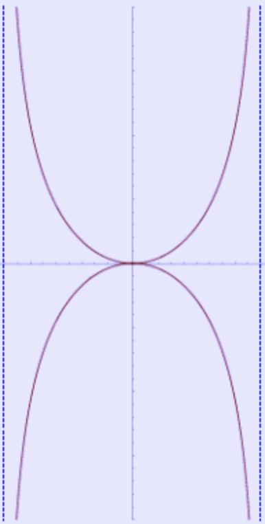

❤: kappa

# Kappa curve

In geometry, the kappa curve or Gutschoven's curve is a two-dimensional algebraic curve resembling the Greek letter $κ$ (kappa).

<figure>

<figcaption align = "center">The kappa curve has two vertical asymptotes</figcaption>
</figure>

For <span class="def:x y">each point $( x , y )$</span>, using the Cartesian coordinate system it can be expressed as:


$$
x ^{2}\left( x ^{2}+ y ^{2}\right)= a ^{2} y ^{2}
$$


Or, using parametric equations, for <span class="def:t a">parameter $t$ and $a$</span>, it can be expressed as:


``` iheartla
cos, cot, tan, sin, arctan, atan from trigonometry
x = a cos(t) cot(t)

where 
a: ℝ 
t: ℝ 
```
``` iheartla
y = a cos(t)
```
In polar coordinates, given <span class="def:θ">angle paremter $θ$</span>, its equation is even simpler:

``` iheartla
r = atan(θ)
where 
θ: ℝ 
```
It has two vertical asymptotes at $\displaystyle{ x =\pm a }$, they have been denoted as blue dashed lines on the graphic.


<span class="def:κ">The kappa curve's curvature $κ$</span> is defined as follows:


``` iheartla
κ(θ) = (8(3-sin^2(θ))sin^4(θ))/(a(sin^2(2θ)+4)^(3/2)) where θ: ℝ 
```
<span class="def:\phi">Tangential angle $\phi$ </span>is defined as follows:
``` iheartla
`$\phi$`(θ) = -arctan(1/2sin(2θ)) where θ: ℝ
```
The kappa curve was first studied by Gérard van Gutschoven around 1662. Other famous mathematicians who have studied it include Isaac Newton and Johann Bernoulli. Its tangents were first calculated by Isaac Barrow in the 17th century.


# Tangents via infinitesimals
The tangent lines of the kappa curve can also be determined geometrically using differentials and the elementary rules of infinitesimal arithmetic. Suppose $x$ and $y$ are variables, while $a$ is taken to be a constant. From the definition of the kappa curve,

$$
x ^{2}\left( x ^{2}+ y ^{2}\right)- a ^{2} y ^{2}=0
$$

Now, an infinitesimal change in our location must also change the value of the left hand side, so

$$
d\left( x ^{2}\left( x ^{2}+ y ^{2}\right)- a ^{2} y ^{2}\right)=0
$$

Distributing the differential and applying appropriate rules,
$$
\begin{aligned}
&d\left( x ^{2}\left( x ^{2}+ y ^{2}\right)\right)-d\left( a ^{2} y ^{2}\right)=0 \\
&(2 x d x )\left( x ^{2}+ y ^{2}\right)+ x ^{2}(2 x d x +2 y d y )- a ^{2} 2 y d y =0 \\
&\left(4 x ^{3}+2 x y ^{2}\right) d x +\left(2 y x ^{2}-2 a ^{2} y \right) d y =0 \\
& x \left(2 x ^{2}+ y ^{2}\right) d x + y \left( x ^{2}- a ^{2}\right) d y =0 \\
&\frac{ x \left(2 x ^{2}+ y ^{2}\right)}{ y \left( a ^{2}- x ^{2}\right)}=\frac{d y }{d x }
\end{aligned}
$$


# Derivative
If we use the modern concept of a functional relationship $y ( x )$ and apply implicit differentiation, the slope of a tangent line to the kappa curve at a point $( x , y )$ is :
$$
\begin{aligned}
&2 x \left( x ^{2}+ y ^{2}\right)+ x ^{2}\left(2 x +2 y \frac{d y }{d x }\right)=2 a ^{2} y \frac{d y }{d x } \\
&2 x ^{3}+2 x y ^{2}+2 x ^{3}=2 a ^{2} y \frac{d y }{d x }-2 x ^{2} y \frac{d y }{d x } \\
&4 x ^{3}+2 x y ^{2}=\left(2 a ^{2} y -2 x ^{2} y \right) \frac{d y }{d x } \\
&\frac{2 x ^{3}+ x y ^{2}}{ a ^{2} y - x ^{2} y }=\frac{d y }{d x }
\end{aligned}
$$


